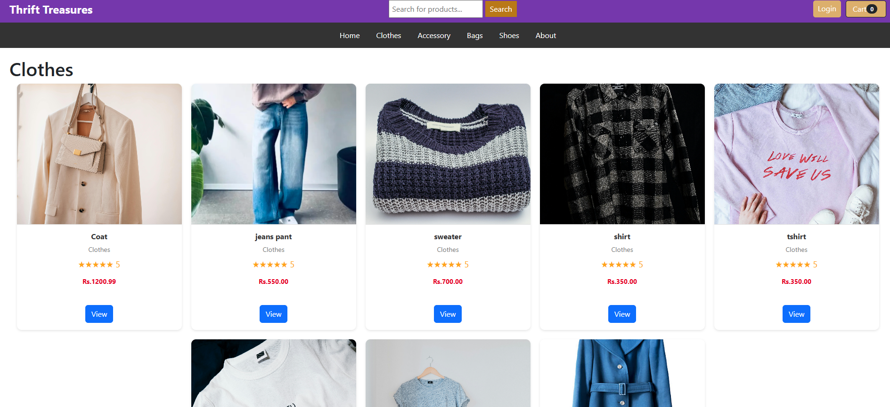
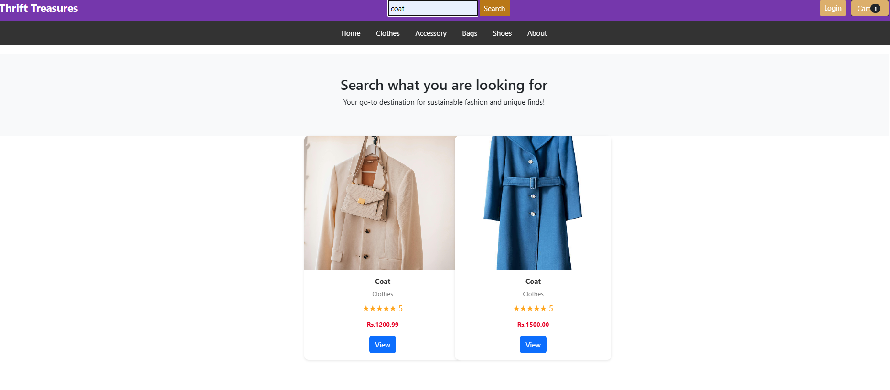

# Thrift Treasures

An e-commerce thrift clothing store built using Django, HTML, CSS, JavaScript, and SQLite.

## Features
- User sign-up/login
- Product search and details
- Cart management (add, update, delete)
- Category-based product browsing
- Checkout with Khalti payment integration

## Getting Started
Clone the repo and run:
```bash
python manage.py runserver


## Screenshots

### Homepage


## Signup page


### Product page


## Cart page


## Search page


## Payment page

