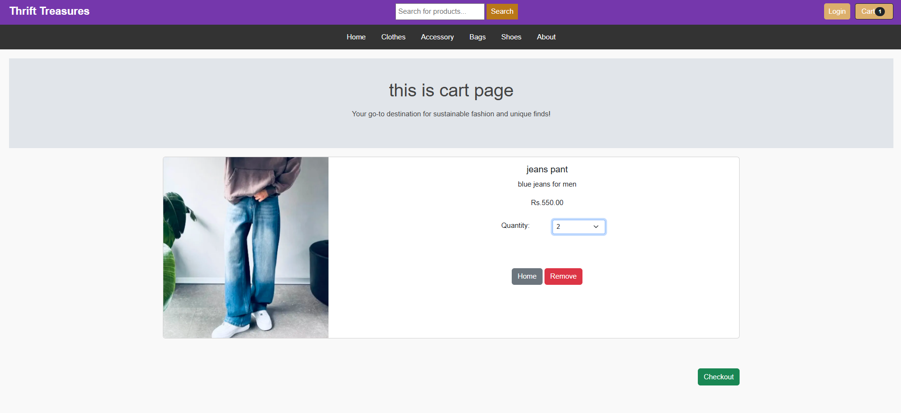

# Thrift Treasures

An e-commerce thrift clothing store built using Django, HTML, CSS, JavaScript, and SQLite.

## Features
- User sign-up/login
- Product search and details
- Cart management (add, update, delete)
- Category-based product browsing
- Checkout with Khalti payment integration

## Getting Started
Clone the repo and run:

python manage.py runserver

## Screenshots

### Homepage

### Signup page

### Product page

### Cart page

### Search page

### Payment page

